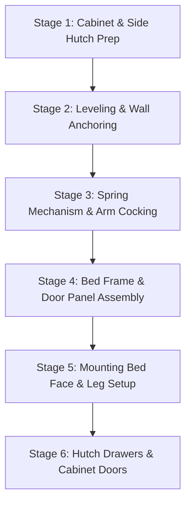

# 🛏️ Breda Beds Murphy Bed Assembly Manual
> **Complete Technical Guide, Hardware Breakdown, & Step-by-Step Instructions**


---

## 📋 Table of Contents
1. [Executive Summary & System Overview](#1-executive-summary--system-overview)
2. [Key Specs & Dimensions Cheat-Sheet](#2-key-specs--dimensions-cheat-sheet)
3. [Required Tools & Hardware Checklist](#3-required-tools--hardware-checklist)
4. [Critical Safety Warnings & Assembly Rules](#4-critical-safety-warnings--assembly-rules)
5. [Step-by-Step Assembly Instructions](#5-step-by-step-assembly-instructions)
   - [Stage 1: Cabinet & Side Hutch Preparation](#stage-1-cabinet--side-hutch-preparation)
   - [Stage 2: Leveling & Wall Anchoring](#stage-2-leveling--wall-anchoring)
   - [Stage 3: Mechanism & Arm Cocking](#stage-3-mechanism--arm-cocking)
   - [Stage 4: Bed Face Frame & Door Panels](#stage-4-bed-face-frame--door-panels)
   - [Stage 5: Mounting Bed Face & Leg Setup](#stage-5-mounting-bed-face--leg-setup)
   - [Stage 6: Side Hutch Drawers & Doors](#stage-6-side-hutch-drawers--doors)
6. [Interactive Assembly Progress Checklist](#6-interactive-assembly-progress-checklist)
7. [Troubleshooting & Maintenance](#7-troubleshooting--maintenance)

---

## 1. Executive Summary & System Overview

This technical shop manual details the end-to-end assembly process for the **Breda Beds Wall Bed System with Side Hutches**. 

```
 +-----------------------------------------------------------------------+
 |                         TOP NAILER (WALL STUDS)                       |
 |  +--------------------+  +--------------------+  +-----------------+  |
 |  |                    |  |                    |  |                 |  |
 |  |    LEFT HUTCH      |  |     MURPHY BED     |  |   RIGHT HUTCH   |  |
 |  |  (Cams & Shelves)  |  |      CABINET       |  | (Cams & Drawers)|  |
 |  |                    |  |                    |  |                 |  |
 |  |                    |  | +----------------+ |  |                 |  |
 |  |                    |  | |  BED FACE DOOR | |  |                 |  |
 |  |                    |  | |  PANELS        | |  |                 |  |
 |  |                    |  | |                | |  |                 |  |
 |  |                    |  | +----------------+ |  |                 |  |
 |  +--------------------+  +--------------------+  +-----------------+  |
 |                      LOWER NAILER (WALL STUDS)                        |
 +-----------------------------------------------------------------------+
```

### Key Highlights & Features:
* **Heavy-Duty Capacity:** Engineered metal subframe structure rated up to **1,400 lbs** across Twin, Full, and Queen size variants.
* **Counter-Balance Spring System:** High-tension spring mechanisms tuned precisely to mattress weight for effortless one-handed opening and closing.
* **Precision 1/2" Header Reveal Offset:** Precise `0.5"` offset required when attaching the metal bed subframe onto the door face panels for seamless cabinet closure.
* **Mandatory Wall Anchoring:** Cabinet **MUST** be securely fastened into structural wall studs via top and bottom nailers before cocking tension arms or mounting bed doors.

---

## 2. Key Specs & Dimensions Cheat-Sheet

| Measurement / Parameter | Value / Specification | Notes / Reference Location |
| :--- | :--- | :--- |
| **Max Frame Capacity** | 1,400 lbs | Twin, Full, and Queen Models |
| **Header Reveal Offset** | **0.5" (1/2 inch)** | Distance from door header end to metal frame edge |
| **Hole 1 Stop Bolt Position** | **6-5/8"** from header | Allen Head Bolt (Acts as rotation stop) |
| **Hole 3 Mechanism Bolt** | **19-1/4"** from header | 5/16" Hex Head seating bolt |
| **Wall Anchoring Hardware** | Cabinet Screws into Studs | Top & Bottom Nailers (1/8" Pilot, 3/8" Countersink) |
| **Mechanism Wrench Size** | **5/16"** Socket / Wrench | For 5/16" Nylock Nuts on mechanism & frame |
| **Leg Tie-Rod Wrench Size**| **1/4"** Socket / Wrench | For 1/4" Leg Tie-Rod Bolts & Star Washers |
| **Hinge Base Plate Mount** | Hole Position #2 | 35mm Euro Door Hinges |

---

## 3. Required Tools & Hardware Checklist

### 🛠️ Required Tools Checklist
- [ ] **Magnetic Stud Finder** (Locating wall studs behind drywall)
- [ ] **Spirit Level** (Verifying cabinet plumb and horizontal level prior to wall anchoring)
- [ ] **Electric Ratchet / Driver** (Rapid tightening of frame nuts, mechanism bolts, and leg tie-rods)
- [ ] **Impact Driver** (Driving heavy-duty wall anchor screws into structural studs)
- [ ] **Power Drill** with:
  - [ ] `1/8"` Drill Bit (Pilot holes into wall studs)
  - [ ] `3/8"` Drill Bit / Countersink Bit (Countersinking screw heads flush into top & bottom nailers)
- [ ] **Tape Measure & Precision Ruler** (Critical for measuring exact 0.5" header reveal offset)
- [ ] **Rubber Mallet** (Tapping cam fittings, wood panels, and leg pivot hardware without marring finish)
- [ ] **Allen Wrench / Hex Key Set** (Subframe corner connectors & Hole 1 stop bolts)
- [ ] **Wrench & Socket Set:**
  - [ ] `5/16"` Wrench / Socket (Mechanism bolts & 5/16" Nylock nuts)
  - [ ] `1/4"` Wrench / Socket (Leg tie-rod bolts)
- [ ] **Screwdrivers** (Phillips & Flathead for cam fittings and hardware handles)
- [ ] **PVC Arm Tension Helper Tube** (Included helper tube for cocking spring arms)
- [ ] **Spray Lubricant** (WD-40 or Silicone spray for spring coils)

---

### 📦 Hardware Package Breakdown
- [ ] **Cam Fittings & Cam Connecting Studs** (Panel locking system)
- [ ] **Fast Caps** (Decorative color-matched screw covers)
- [ ] **Heavy-Duty Counter-Balance Springs** (Tension mechanism)
- [ ] **Hardware Card 3** (Bed face frame 4-corner connectors)
- [ ] **Hardware Card 7** (Metal bed subframe to door panel screws)
- [ ] **Stop Cylinders** (Inserted into lower corner bracket holes)
- [ ] **Allen Head Bolts & 5/16" Nylock Nuts** (Hole 1 stop bolt - 6-5/8" offset)
- [ ] **5/16" Hex Head Bolts & Nylock Nuts** (Hole 3 mechanism seating bolt - 19-1/4" offset, & Hole 2 lock bolt)
- [ ] **Leg Pivot Assembly Set:**
  - [ ] Nylon washers
  - [ ] Steel filler washers
  - [ ] Steel holding washers
  - [ ] Nylock nuts
- [ ] **Steel Leg Tie-Rod Kit** (Tie-rod bar, 1/4" bolts, star washers)
- [ ] **Cabinet Wall Anchoring Screws** (Top & bottom nailers)
- [ ] **Drawer Slide Tracks & Hardware** (Side hutch units)
- [ ] **35mm Euro Door Hinges & Base Plates** (Mounting position #2)

---

## 4. Critical Safety Warnings & Assembly Rules

> [!WARNING]
> ### HIGH TENSION MECHANISM ARMS
> The spring mechanism arms operate under extreme mechanical tension once cocked. **NEVER** attempt to pull down or trip spring mechanism arms without using the provided PVC helper tube and maintaining a firm grip. Keep hands clear of mechanism pivot points.

> [!IMPORTANT]
> ### MANDATORY STRUCTURAL WALL ANCHORING
> Do **NOT** cock the spring arms or mount the bed face assembly until the cabinet is securely leveled and anchored to wall studs via both the top and bottom nailers using heavy-duty wall screws. Failure to anchor the cabinet will cause it to tip forward aggressively.

> [!CAUTION]
> ### CRITICAL 1/2" REVEAL OFFSET
> When securing the metal frame to the rear face of the door panels, you **MUST** measure and set a precise **1/2-inch (0.5")** reveal offset from the header edge. Imprecise alignment will prevent cabinet closure and bind door operation.

---

## 5. Step-by-Step Assembly Instructions



---

### Stage 1: Cabinet & Side Hutch Preparation

#### Step 1: Hardware Pre-Insertion
* Lay all cabinet and side hutch panels flat on a clean, soft surface (carpet or blanket).
* Press cam fittings into pre-bored panel holes.
* Thread cam connecting studs into their corresponding pilot holes until seated flush.

#### Step 2: Hutch Assembly
* Align the hutch side panels with the top and bottom panels.
* Using a Phillips screwdriver, turn cam fittings clockwise to securely lock the hutch boxes together.

#### Step 3: Outer Cabinet Assembly
* Position the assembled side hutches approximately `16"` away from the target wall.
* Attach the top nailer to the bed cabinet top panel.
* Secure the top assembly and lower toe kick to the right hutch.
* Slide and align the left hutch into position; lock all connecting cams firmly.

#### Step 4: Headboard & Lower Nailer
* Insert the headboard and lower nailer panel with cam fittings facing upward.
* Lock all cams securely to rigidize the overall cabinet superstructure.

---

### Stage 2: Leveling & Wall Anchoring

#### Step 5: Position & Level Cabinet
* Carefully tilt the assembled bed cabinet upright and move into final position flush against the wall.
* Use a spirit level to verify level both side-to-side and front-to-back.
* Slide wood shims underneath the cabinet feet where necessary to achieve absolute level.

#### Step 6: Mark & Drill Wall Studs
* Use a stud finder to locate solid wall studs behind the top nailer board.
* Mark the stud centerlines directly onto the top nailer.
* Drill `1/8"` pilot holes through the top nailer into each located wall stud.

#### Step 7: Countersink & Drive Wall Screws
* Countersink all drilled holes using a `3/8"` bit or countersink tool.
* Drive heavy-duty wall screws through the nailer into the wall studs.
* Press decorative **Fast Caps** over all exposed screw heads.

---

### Stage 3: Mechanism & Arm Cocking

#### Step 8: Install Counter-Balance Springs
* Consult the spring application table for your specific bed size (Twin/Full/Queen) and mattress weight.
* Insert the designated number of heavy-duty springs onto the left and right mechanism backing plates.

#### Step 9: Attach Mechanism to Cabinet
* Mount the spring mechanism plate assembly to the interior side walls of the cabinet using the dedicated hardware tube screws.
* Ensure all bolts are torqued down snugly against the side panels.

#### Step 10: Cock Mechanism Arms
* Slip the provided **PVC helper tube** over the end of the spring arm.
* Firmly pull the arm downward until the internal arm lock engages with an audible **CLICK**.
* Carefully remove the PVC tube and repeat for the opposite mechanism arm.

---

### Stage 4: Bed Face Frame & Door Panels

#### Step 11: Assemble Metal Bed Frame
* Lay out the heavy-duty steel frame channels on the floor.
* Connect the four corners of the subframe using hardware from **Hardware Card 3**.
* Press the **Stop Cylinders** into the lower corner bracket holes on the two corners farthest from the cabinet.

#### Step 12: Align Door Panels
* Place door panels face-down on a soft, protective surface with handle holes oriented farthest from the cabinet.
* Press the door panels tightly together along the center seam to ensure zero gap.

#### Step 13: Frame-to-Door Placement (CRITICAL STEP)
* Carefully position the assembled metal bed subframe over the rear face of the door panels.
* **CRITICAL MEASUREMENT:** Set the subframe edge exactly **1/2 INCH (0.5")** back from the header end of the door panels.
* Drive mounting screws from **Hardware Card 7** to secure the metal frame to the door panels.

```
 +-----------------------------------------------------------------------+
 |                         DOOR PANEL HEADER                             |
 |                                                                       |
 |   <====================== 0.5" REVEAL OFFSET ======================>  |
 |  +-----------------------------------------------------------------+  |
 |  |                       STEEL BED SUBFRAME                        |  |
 |  |                                                                 |  |
```

#### Step 14: Install Support Stiffeners
* Attach the center support stiffener channel midway between the header and footer frame tubes.
* Install the remaining two support stiffener channels evenly spaced between the center stiffener and bed ends.

#### Step 15: Install Mechanism Pivot Bolts
* **Hole 1 (Stop Bolt):** Insert an Allen head bolt into Hole 1 (**6-5/8"** from header edge) and secure with a `5/16"` Nylock nut. (Acts as the rotation stop).
* **Hole 3 (Seating Bolt):** Insert a `5/16"` Hex head bolt into Hole 3 (**19-1/4"** from header edge) from the outside; finger-tighten a `5/16"` Nylock nut.

---

### Stage 5: Mounting Bed Face & Leg Setup

#### Step 16: Mount Face Assembly to Arms
* Lift and position the bed face panel assembly vertically between the cocked mechanism arms.
* Seat the Hole 3 hex bolts directly into the receiver notches located at the end of the mechanism arms.

#### Step 17: Rotate & Secure Bed Face
* Pivot the bed face outward until the Hole 1 Allen stop bolt rests firmly against the mechanism notch.
* Insert a `5/16"` Hex bolt into Hole 2.
* Fully tighten all nuts at **Hole 2** and **Hole 3** using a `5/16"` wrench. Attach door handles.

#### Step 18: Release Mechanism Arm Locks
* Pull outward on the top of the bed face panel to disengage the mechanical arm safety locks (listen for the release click).
* *Note: Operating tension will feel heavy until the mattress is loaded.*

#### Step 19: Install Legs & Tie-Rod
* Assemble the pivot legs: Slide a nylon washer onto the leg stem, pass through the frame hole, and secure from the inside with a steel filler washer, steel holding washer, and `5/16"` Nylock nut.
* Rotate legs down into the open position against their stops.
* Connect the steel leg tie-rod bar between both legs using `1/4"` bolts and star washers.

#### Step 20: Align Reveals & Attach Bottom Nailer
* Close the bed face assembly while pivoting the legs closed.
* Inspect side reveal gaps for uniformity. Nudge the cabinet base slightly if needed to square up reveals.
* Secure the lower nailer to wall studs using 1 screw per side.

#### Step 21: Spring Coil Lubrication
* If spring coil noise is heard during initial operation, spray **WD-40** or **Silicone Lubricant** across the spring coils.
* Open and close the bed 3-5 times to evenly distribute lubricant.

---

### Stage 6: Side Hutch Drawers & Doors

#### Step 22: Drawer Box Assembly
* Install cam fittings into side drawer panels.
* Assemble drawer box sides to the back panel, slide drawer bottom into alignment grooves, and attach the front drawer face.
* Install hardware handles.

#### Step 23: Drawer Slide Track Setup
* Mount drawer slide tracks flush to the lower edge of the drawer box, pressing firmly against the back of the front face.
* Mount interior slide tracks into pre-bored holes in the hutch cabinet walls.
* Slide drawers into cabinet tracks until smoothly engaged.

#### Step 24: Hutch Cabinet Doors
* Press hinge base plates into outside panel hole pattern **#2**.
* Seat 35mm Euro hinges into door cup holes and turn locking screws `1/2` turn clockwise.
* Snap hinges onto base plates and adjust alignment screws for square door gaps. Attach handles.

---

## 6. Interactive Assembly Progress Checklist

### 🟢 Phase 1: Substructure & Wall Anchoring
- [ ] Pre-insert all cam fittings & studs
- [ ] Assemble side hutch boxes
- [ ] Join main cabinet & top nailer
- [ ] Level cabinet with shims
- [ ] Anchor top nailer into wall studs (1/8" pilot, 3/8" countersink)

### 🟡 Phase 2: Mechanism Setup
- [ ] Install springs according to mattress weight chart
- [ ] Bolt mechanism plates to cabinet side walls
- [ ] Cock spring arms downward using PVC helper tube (listen for lock click)

### 🔵 Phase 3: Bed Face & Frame Assembly
- [ ] Assemble 4 corners of steel subframe (Hardware Card 3)
- [ ] Place frame onto door panels with exact **0.5" header reveal**
- [ ] Drive frame screws (Hardware Card 7)
- [ ] Install center and outer support stiffeners
- [ ] Install Hole 1 stop bolt (6-5/8") & Hole 3 seating bolt (19-1/4")

### 🟣 Phase 4: Final Mounting, Legs & Hutch Finishing
- [ ] Seat Hole 3 bolts into arm notches & secure Hole 2 bolts
- [ ] Release spring arm safety locks
- [ ] Install pivot legs & steel leg tie-rod bar (1/4" hardware)
- [ ] Check reveal symmetry & anchor bottom nailer
- [ ] Lubricate spring coils if needed
- [ ] Assemble hutch drawers & install Euro hinge cabinet doors (Hole #2)

---

## 7. Troubleshooting & Maintenance

| Issue / Symptom | Possible Cause | Corrective Action |
| :--- | :--- | :--- |
| **Spring Noise / Squeaking** | Friction between dry spring coils | Spray WD-40 or silicone lube on coils and cycle bed 5 times. |
| **Uneven Side Reveals** | Cabinet base out of square | Lightly nudge cabinet base or adjust shims under feet before locking bottom nailer. |
| **Bed Hard to Lower** | Mattress not yet loaded | Heavy initial pull tension is normal until mattress weight is present. |
| **Cabinet Gaps at Top** | Top nailer screws loose | Re-tighten wall anchor screws directly into stud centers. |
| **Door Binds When Closing** | Reveal offset incorrect | Loosen Card 7 screws and re-align frame to exact 0.5" header reveal. |

---
*Manual compiled from official project specifications for GitHub Pages documentation.*
